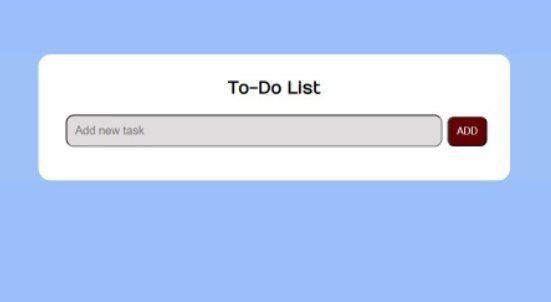
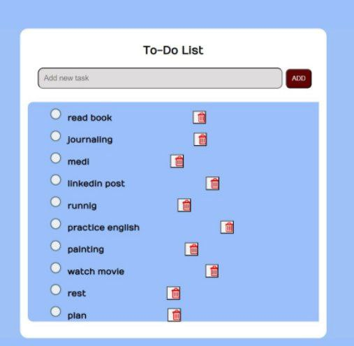

برنامه ی نوشتن وظایف، استفاده ی آسان برای همه.

ویژگی ها:
نوشتن 10 وظیفه
حذف وظیفه ی انجام شده
تیک زدن در صورت انجام شدن یک وظیفه
خوانا بودن وظایف

تکنولوژی ها:
HTML
CSS
JavaScript

Project: To-Do List App - Easy Task Management

A simple and easy-to-use to-do list app designed for everyone. With the ability to add up to 10 tasks, mark tasks as done, and remove completed tasks, this app offers a minimalist and effective solution to stay organized.

Features:

Add up to 10 tasks
Mark tasks as done
Remove completed tasks
Clear and readable task list

Technologies Used:

HTML
CSS
JavaScript

License:
[Insert License Information here, if applicable]

